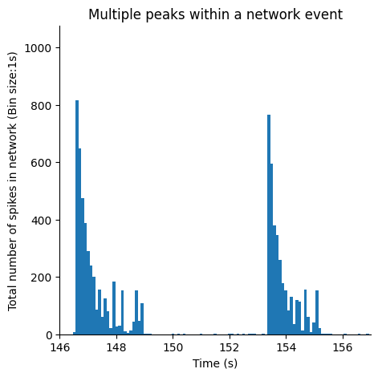
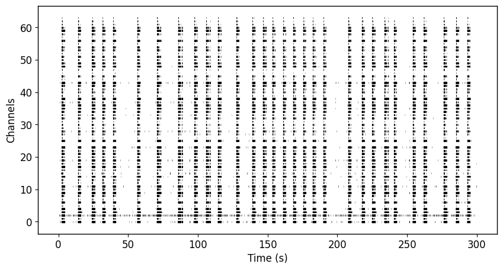
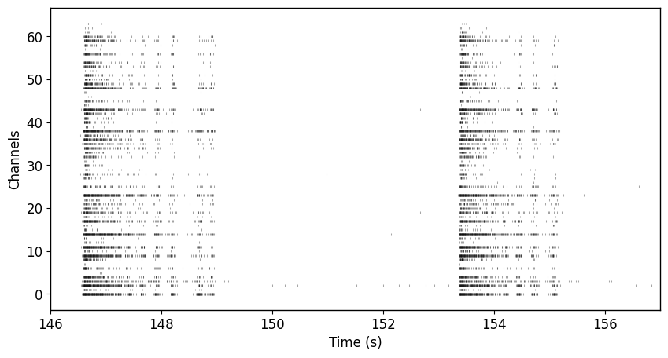
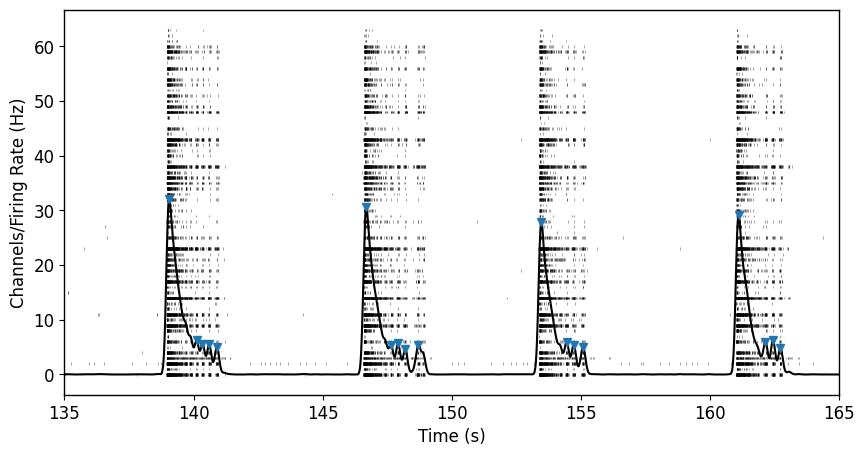
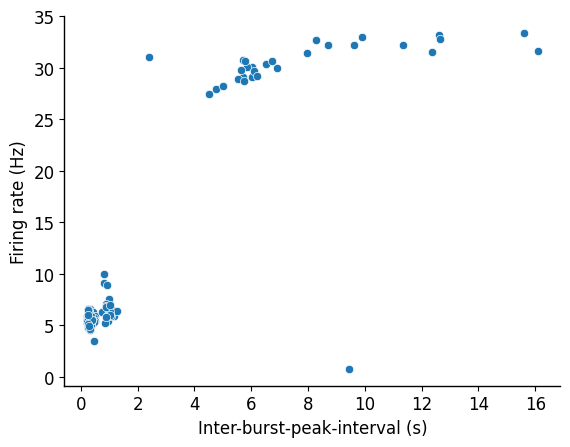
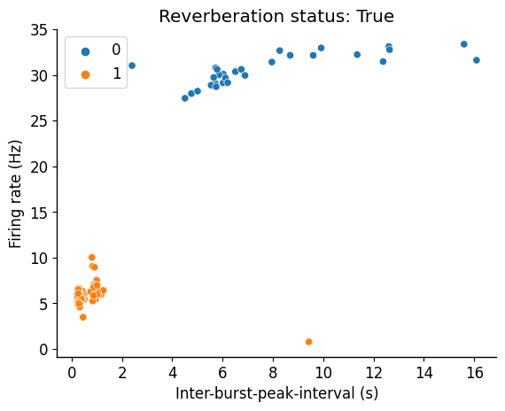

## Install necessary packages

## Import libraries


```python
import pandas as pd
import numpy as np
import matplotlib.pyplot as plt
import seaborn as sns
import math

from scipy.stats import norm
from scipy.signal import convolve
from scipy.signal import find_peaks

from sklearn.cluster import KMeans
from sklearn.preprocessing import StandardScaler

```


```python
filename = "/content/drive/MyDrive/Colab Notebooks/spike_data.csv"
fs = 12500
```

## Convert Axion Biosystem's spike_list.csv file into a dataframe


```python
def organize_spikelist(filepath):
    # Create neuralMetric dataframe
    spikelist_file = pd.read_csv(filepath, sep='\r\n', header=None)
    spikelist_file = spikelist_file[0].str.split(',', expand=True)
    spikelist_file.columns = spikelist_file.iloc[0]
    spikelist_file = spikelist_file.iloc[1:]

    spiketimes = spikelist_file[["Time (s)", "Electrode"]]
    spiketimes = spiketimes.iloc[:-8]
    spiketimes = spiketimes.dropna()
    spiketimes = spiketimes[spiketimes["Electrode"].str.contains("_")]
    spiketimes = spiketimes.astype({"Time (s)": float})
    spiketimes["Well"] = [electrode.split("_")[0] for electrode in list(spiketimes["Electrode"].values)]
    spiketimes["Channel"] = [electrode.split("_")[1] for electrode in list(spiketimes["Electrode"].values)]

    r,c = np.where(spikelist_file == "Well Information")
    metadata_slice = spikelist_file.iloc[r[0]:].transpose().reset_index()
    metadata_slice.columns = metadata_slice.iloc[0]
    metadata_slice = metadata_slice.iloc[1:]
    metadata = {}
    label = []
    for i, well in enumerate(metadata_slice["Well"]):
        if well != None:
            metadata[well] = metadata_slice.iloc[i]["Treatment"]
            label.append(str(well)+"-"+str(metadata_slice.iloc[i]["Treatment"]))

    return spiketimes, metadata, label

spiketimes, metadata, label = organize_spikelist(filename)
```

    <ipython-input-4-4aef381c3626>:3: ParserWarning: Falling back to the 'python' engine because the 'c' engine does not support regex separators (separators > 1 char and different from '\s+' are interpreted as regex); you can avoid this warning by specifying engine='python'.
      spikelist_file = pd.read_csv(filepath, sep='\r\n', header=None)


```python
spiketimes.head()
```


  <div id="df-a25a432f-46e4-46a0-819c-bc2bea4e0195" class="colab-df-container">
    <div>
<style scoped>
    .dataframe tbody tr th:only-of-type {
        vertical-align: middle;
    }

    .dataframe tbody tr th {
        vertical-align: top;
    }

    .dataframe thead th {
        text-align: right;
    }
</style>
<table border="1" class="dataframe">
  <thead>
    <tr style="text-align: right;">
      <th></th>
      <th>Time (s)</th>
      <th>Electrode</th>
      <th>Well</th>
      <th>Channel</th>
    </tr>
  </thead>
  <tbody>
    <tr>
      <th>1</th>
      <td>0.00184</td>
      <td>A1_76</td>
      <td>A1</td>
      <td>76</td>
    </tr>
    <tr>
      <th>2</th>
      <td>0.00824</td>
      <td>C1_51</td>
      <td>C1</td>
      <td>51</td>
    </tr>
    <tr>
      <th>3</th>
      <td>0.01160</td>
      <td>B1_47</td>
      <td>B1</td>
      <td>47</td>
    </tr>
    <tr>
      <th>4</th>
      <td>0.01984</td>
      <td>A1_42</td>
      <td>A1</td>
      <td>42</td>
    </tr>
    <tr>
      <th>5</th>
      <td>0.02224</td>
      <td>C1_41</td>
      <td>C1</td>
      <td>41</td>
    </tr>
  </tbody>
</table>
</div>
    <div class="colab-df-buttons">

  <div class="colab-df-container">
    <button class="colab-df-convert" onclick="convertToInteractive('df-a25a432f-46e4-46a0-819c-bc2bea4e0195')"
            title="Convert this dataframe to an interactive table."
            style="display:none;">

  <svg xmlns="http://www.w3.org/2000/svg" height="24px" viewBox="0 -960 960 960">
    <path d="M120-120v-720h720v720H120Zm60-500h600v-160H180v160Zm220 220h160v-160H400v160Zm0 220h160v-160H400v160ZM180-400h160v-160H180v160Zm440 0h160v-160H620v160ZM180-180h160v-160H180v160Zm440 0h160v-160H620v160Z"/>
  </svg>
    </button>

  <style>
    .colab-df-container {
      display:flex;
      gap: 12px;
    }

    .colab-df-convert {
      background-color: #E8F0FE;
      border: none;
      border-radius: 50%;
      cursor: pointer;
      display: none;
      fill: #1967D2;
      height: 32px;
      padding: 0 0 0 0;
      width: 32px;
    }

    .colab-df-convert:hover {
      background-color: #E2EBFA;
      box-shadow: 0px 1px 2px rgba(60, 64, 67, 0.3), 0px 1px 3px 1px rgba(60, 64, 67, 0.15);
      fill: #174EA6;
    }

    .colab-df-buttons div {
      margin-bottom: 4px;
    }

    [theme=dark] .colab-df-convert {
      background-color: #3B4455;
      fill: #D2E3FC;
    }

    [theme=dark] .colab-df-convert:hover {
      background-color: #434B5C;
      box-shadow: 0px 1px 3px 1px rgba(0, 0, 0, 0.15);
      filter: drop-shadow(0px 1px 2px rgba(0, 0, 0, 0.3));
      fill: #FFFFFF;
    }
  </style>

    <script>
      const buttonEl =
        document.querySelector('#df-a25a432f-46e4-46a0-819c-bc2bea4e0195 button.colab-df-convert');
      buttonEl.style.display =
        google.colab.kernel.accessAllowed ? 'block' : 'none';

      async function convertToInteractive(key) {
        const element = document.querySelector('#df-a25a432f-46e4-46a0-819c-bc2bea4e0195');
        const dataTable =
          await google.colab.kernel.invokeFunction('convertToInteractive',
                                                    [key], {});
        if (!dataTable) return;

        const docLinkHtml = 'Like what you see? Visit the ' +
          '<a target="_blank" href=https://colab.research.google.com/notebooks/data_table.ipynb>data table notebook</a>'
          + ' to learn more about interactive tables.';
        element.innerHTML = '';
        dataTable['output_type'] = 'display_data';
        await google.colab.output.renderOutput(dataTable, element);
        const docLink = document.createElement('div');
        docLink.innerHTML = docLinkHtml;
        element.appendChild(docLink);
      }
    </script>
  </div>


<div id="df-4e3a6e10-7901-42d9-a864-ccb3a4720420">
  <button class="colab-df-quickchart" onclick="quickchart('df-4e3a6e10-7901-42d9-a864-ccb3a4720420')"
            title="Suggest charts."
            style="display:none;">

<svg xmlns="http://www.w3.org/2000/svg" height="24px"viewBox="0 0 24 24"
     width="24px">
    <g>
        <path d="M19 3H5c-1.1 0-2 .9-2 2v14c0 1.1.9 2 2 2h14c1.1 0 2-.9 2-2V5c0-1.1-.9-2-2-2zM9 17H7v-7h2v7zm4 0h-2V7h2v10zm4 0h-2v-4h2v4z"/>
    </g>
</svg>
  </button>

<style>
  .colab-df-quickchart {
      --bg-color: #E8F0FE;
      --fill-color: #1967D2;
      --hover-bg-color: #E2EBFA;
      --hover-fill-color: #174EA6;
      --disabled-fill-color: #AAA;
      --disabled-bg-color: #DDD;
  }

  [theme=dark] .colab-df-quickchart {
      --bg-color: #3B4455;
      --fill-color: #D2E3FC;
      --hover-bg-color: #434B5C;
      --hover-fill-color: #FFFFFF;
      --disabled-bg-color: #3B4455;
      --disabled-fill-color: #666;
  }

  .colab-df-quickchart {
    background-color: var(--bg-color);
    border: none;
    border-radius: 50%;
    cursor: pointer;
    display: none;
    fill: var(--fill-color);
    height: 32px;
    padding: 0;
    width: 32px;
  }

  .colab-df-quickchart:hover {
    background-color: var(--hover-bg-color);
    box-shadow: 0 1px 2px rgba(60, 64, 67, 0.3), 0 1px 3px 1px rgba(60, 64, 67, 0.15);
    fill: var(--button-hover-fill-color);
  }

  .colab-df-quickchart-complete:disabled,
  .colab-df-quickchart-complete:disabled:hover {
    background-color: var(--disabled-bg-color);
    fill: var(--disabled-fill-color);
    box-shadow: none;
  }

  .colab-df-spinner {
    border: 2px solid var(--fill-color);
    border-color: transparent;
    border-bottom-color: var(--fill-color);
    animation:
      spin 1s steps(1) infinite;
  }

  @keyframes spin {
    0% {
      border-color: transparent;
      border-bottom-color: var(--fill-color);
      border-left-color: var(--fill-color);
    }
    20% {
      border-color: transparent;
      border-left-color: var(--fill-color);
      border-top-color: var(--fill-color);
    }
    30% {
      border-color: transparent;
      border-left-color: var(--fill-color);
      border-top-color: var(--fill-color);
      border-right-color: var(--fill-color);
    }
    40% {
      border-color: transparent;
      border-right-color: var(--fill-color);
      border-top-color: var(--fill-color);
    }
    60% {
      border-color: transparent;
      border-right-color: var(--fill-color);
    }
    80% {
      border-color: transparent;
      border-right-color: var(--fill-color);
      border-bottom-color: var(--fill-color);
    }
    90% {
      border-color: transparent;
      border-bottom-color: var(--fill-color);
    }
  }
</style>

  <script>
    async function quickchart(key) {
      const quickchartButtonEl =
        document.querySelector('#' + key + ' button');
      quickchartButtonEl.disabled = true;  // To prevent multiple clicks.
      quickchartButtonEl.classList.add('colab-df-spinner');
      try {
        const charts = await google.colab.kernel.invokeFunction(
            'suggestCharts', [key], {});
      } catch (error) {
        console.error('Error during call to suggestCharts:', error);
      }
      quickchartButtonEl.classList.remove('colab-df-spinner');
      quickchartButtonEl.classList.add('colab-df-quickchart-complete');
    }
    (() => {
      let quickchartButtonEl =
        document.querySelector('#df-4e3a6e10-7901-42d9-a864-ccb3a4720420 button');
      quickchartButtonEl.style.display =
        google.colab.kernel.accessAllowed ? 'block' : 'none';
    })();
  </script>
</div>
    </div>
  </div>


```python
spiketimes["Well"].unique()
```


    array(['A1', 'C1', 'B1', 'A4', 'C2', 'B2', 'B4', 'A2', 'C3', 'C4', 'B3',
           'A3'], dtype=object)


```python
spiketimes["Channel"].unique()
```


    array(['76', '51', '47', '42', '41', '16', '26', '13', '18', '31', '84',
           '44', '82', '38', '85', '32', '88', '78', '11', '72', '87', '75',
           '48', '62', '24', '65', '63', '25', '15', '43', '81', '61', '46',
           '58', '83', '55', '57', '52', '12', '73', '22', '56', '67', '77',
           '66', '53', '36', '74', '86', '45', '23', '33', '21', '14', '71',
           '17', '37', '35', '28', '54', '27', '34', '68', '64'], dtype=object)


```python
duration = int(math.ceil(max(spiketimes["Time (s)"])/100.0))*100
print(f"It appears the duration of these recordings was {duration} seconds.")
```

    It appears the duration of these recordings was 300 seconds.


The data that we'll be dealing with are spike times from a 12-well multielectrode array system. Each well contains 64 channels (arranged in an 8x8 grid). Channels are labeled according to a cartesian coordinate system where the first digit represents x (or the row) and the second digit represents y (or the column).

## Select a well to analyze
This is where you would start wrapping the below code into a loop that iterates through each well, each plate/recording.


```python
well_id = "A3"
```

## Quick look at the network activity
Here we are plotting a histogram of spike times from the well we selected, using a bin size of 0.1 seconds (300 second duration/3000 bins).


```python
plt.figure(figsize=(10,5))
plt.hist(spiketimes[spiketimes["Well"]==well_id]["Time (s)"], bins=3000);
sns.despine()
plt.xlabel("Time (s)")
plt.ylabel("Total number of spikes in network (Bin size:1s)")
plt.title("Sort of like a PSTH - representing network activity")
```


    Text(0.5, 1.0, 'Sort of like a PSTH - representing network activity')


    

    


It looks like there is some interesting network bursting activity! Are these reverberating super bursts (RSB) like the ones mentioned in Pradeepan et al., 2023? 😂

Jokes aside, the code below will help identify whether this is or isn't an RSB. But for now, we'll plot a close up of a smaller window.


```python
# Definitely do not keep plotting histograms with large bin sizes if you want your code to run fast
plt.figure(figsize=(5,5))
plt.hist(spiketimes[spiketimes["Well"]==well_id]["Time (s)"], bins=3000);
sns.despine()
plt.xlim(146, 157)
plt.xlabel("Time (s)")
plt.ylabel("Total number of spikes in network (Bin size:1s)")
plt.title("Multiple peaks within a network event")
```


    Text(0.5, 1.0, 'Multiple peaks within a network event')


    

    


## Sort data frame containing mixed-bag of electrode and spike times based on channel name


```python
channel_ids = [i for j in range(1, 9) for i in range(j * 10 + 1, j * 10 + 9)]
'''
The above produces the following:
  [11, 12, 13, 14, 15, 16, 17, 18,
  21, 22, 23, 24, 25, 26, 27, 28,
  31, 32, 33, 34, 35, 36, 37, 38,
  41, 42, 43, 44, 45, 46, 47, 48,
  51, 52, 53, 54, 55, 56, 57, 58,
  61, 62, 63, 64, 65, 66, 67, 68,
  71, 72, 73, 74, 75, 76, 77, 78,
  81, 82, 83, 84, 85, 86, 87, 88]
'''

def generate_raster(spiketimes, well_id, duration, channel_ids):
  '''
  well_data: Data frame in the format seen above
  duration: Length of recording in seconds (in this case 300 seconds)
  channel_ids: Name of all channels in the format seen in the data frame "channel" column
  '''
  raster = []
  # Loop through each channel regardless of activity
  well_spiketimes = spiketimes[spiketimes["Well"] == well_id].reset_index(drop=True)
  for channel in channel_ids:
    # If the channel is found in my data (i.e., it had at least 1 spike)
    if str(channel) in well_spiketimes["Channel"].to_list():
      # Find spike times associated with that channel
      spiketrain = well_spiketimes.loc[well_spiketimes["Channel"]==str(channel), well_spiketimes.columns.str.contains("Time")].reset_index(drop=True)
      # Convert spike times that occur before the end of the recording (i.e., duration) to an array
      spiketrain = spiketrain.to_numpy().flatten()[spiketrain.to_numpy().flatten() <= duration]
      # Store array
      raster.append(spiketrain)
    # If the channel is not found in my data, I still want to store that it was empty
    else:
      raster.append([])
  return raster

raster = generate_raster(spiketimes, well_id, duration, channel_ids)
```

## Visualize network activity (as a raster plot)


```python
plt.figure(figsize=(10,5))
plt.rcParams.update({'font.size': 12})
plt.rc('axes', linewidth=1)
plt.eventplot(raster, color='black', linelengths=0.5, linewidths=0.75, alpha=0.35);
plt.ylabel("Channels")
plt.xlabel("Time (s)")
```


    Text(0.5, 0, 'Time (s)')


    

    


We did it with the histogram, might as well do it with the raster. 🤷


```python
plt.figure(figsize=(10,5))
plt.rcParams.update({'font.size': 12})
plt.rc('axes', linewidth=1)
plt.eventplot(raster, color='black', linelengths=0.5, linewidths=0.75, alpha=0.35);
plt.xlim(146, 157)
plt.ylabel("Channels")
plt.xlabel("Time (s)")
```


    Text(0.5, 0, 'Time (s)')


    

    


## Approach 1: Generate spike density function

### Gaussian Kernel
Note: You should be using a bandwidth optimized kernel. Refer to Shimazaki & Shinomoto, 2010)


```python
def generate_gaussian_kernel(sigma=0.1, fs=12500):
    '''
    :param sigma: Width of kernel
    :param fs: Sampling frequency in Hz
    :return: Gaussian kernel
    '''
    edges = np.arange(-3 * sigma, 3 * sigma, 1 / fs)
    kernel = norm.pdf(edges, 0, sigma)
    kernel = kernel / max(kernel)
    return kernel
```

### Binary spike matrix
Create a matrix of nChannels x Y time points, where Y is the duration * sampling frequency.
Each cell will contain either a 0 or 1 depending on whether a spike was found i.e., 1 or not i.e., 0.


```python
def generate_spikematrix(spiketrain, fs=12500, duration=300):
    '''
    :param spiketrain: Takes spikes times from a single channel
    :param fs: Sampling frequency in Hz
    :param duration: Duration of recording in seconds
    :return: spikematrix: Binary matrix containing spikes
    '''
    spiketimes = np.array(spiketrain)
    spiketimes = spiketimes[spiketimes <= duration]  # Ensure recording is desired length
    spikematrix = [0] * (duration * fs)  # Generate empty spike matrix with appropriate number of bins
    for spike in spiketimes:
        spikematrix[int(spike * fs)] = 1
    return spikematrix
```

### Convolve gaussian kernel and spike matrix


```python
def generate_sdf(spikematrix, gaussian_kernel):
    '''
    :param spikematrix: Binary matrix containing spikes
    :param gaussian_kernel: Gaussian kernel to be convolved with spikematrix
    :return: sdf: Continuous timeseries representing probability distribution of activity
    '''
    sdf_tmp = convolve(spikematrix, gaussian_kernel)
    sdf = sdf_tmp[int((len(sdf_tmp)-len(spikematrix))/2):int(len(sdf_tmp)-((len(sdf_tmp)-len(spikematrix))/2))]
    sdf = sdf/max(gaussian_kernel)
    return sdf
```

### Iterate through each channel, and generate the channel's SDF
Convolution takes some time because the spike matrix is quite large. There is a way to avoid spike density function generation by relying solely on histograms (like you saw above) but the timing of network event boundaries will be less precise.


```python
kernel = generate_gaussian_kernel(sigma=0.075)

maxFR, channel_sdf = [], []
for n, channel in enumerate(channel_ids):
  spiketrain = raster[n]
  channel_spikematrix = generate_spikematrix(spiketrain, fs=12500, duration=duration)
  sdf_tmp = generate_sdf(channel_spikematrix, kernel)
  channel_sdf.append(sdf_tmp)
  maxFR.append(max(sdf_tmp))
```


```python
network_sdf = np.mean(channel_sdf, axis=0)
weighted_network_sdf = np.average(channel_sdf, axis=0, weights=maxFR)
```


```python
plt.figure(figsize=(10,5))
t = np.arange(0,duration,1/12500)
plt.plot(t,network_sdf)
plt.plot(t,weighted_network_sdf)
plt.xlim(146, 157)
plt.ylabel("Channels/Firing Rate (Hz)")
plt.xlabel("Time (s)")
plt.legend(["Network SDF", "Weighted Network SDF"])
```


    <matplotlib.legend.Legend at 0x7aaa5bd15930>


    

    


As you can see, the general shape of the spike density function (which is an estimate of the network's instantaneous firing rate) is the same between the non-maxFR-weighted SDF and the maxFR-weighted SDF. You can use whichever one, but I prefer to use the maxFR-weighted SDF because it helps improve signal:noise for subsequent analysis.

## Visualize raster plot and spike density function


```python
plt.figure(figsize=(10,5))
plt.rcParams.update({'font.size': 12})
plt.rc('axes', linewidth=1)
plt.eventplot(raster, color='black', linelengths=0.5, linewidths=0.75, alpha=0.35);
t = np.arange(0,duration,1/12500)
plt.plot(t,weighted_network_sdf, color='black')
plt.xlim(146, 157)
plt.ylabel("Channels/Firing Rate (Hz)")
plt.xlabel("Time (s)")
```


    Text(0.5, 0, 'Time (s)')


    

    


As you can see, generally the spike density function does a really good job of representing the average activity across the network. You may notice that the "ramp-up" prior to each network burst starts before activity has truly started. This is largely an artifact of the gaussian kernel. To avoid this, you can use an alpha function or any function that you feel represents the probability of an action potential the best. For this example, and generally most purposes, a gaussian kernel will suffice.

# Reverberating Network Detection

## Did this network have a sufficiently high firing rate to warrant further analysis?


```python
isBursting = False
BURST_THRESHOLD = 5
if max(weighted_network_sdf) >= BURST_THRESHOLD:
  isBursting = True

print(f"Is Network Bursting? {isBursting}")
```

    Is Network Bursting? True


## Peak detection


```python
def detect_burst_peaks(sdf, delta=0.5, fs=12500):
    '''
    :param sdf: Spike density function
    :param fr: Minimum average firing rate (amplitude in SDF) required to be considered a burst
    :return: Burst peak times
    '''
    burst_peaks, _ = find_peaks(sdf, prominence=delta)
    return burst_peaks/fs
```


```python
burst_peak_times = []
if isBursting:
  burst_peak_times = detect_burst_peaks(weighted_network_sdf)
print(f"Detected {len(burst_peak_times)} potential network bursts.")
```

    Detected 145 potential network bursts.


```python
plt.figure(figsize=(10,5))
plt.rcParams.update({'font.size': 12})
plt.rc('axes', linewidth=1)
plt.eventplot(raster, color='black', linelengths=0.5, linewidths=0.75, alpha=0.35);
t = np.arange(0,duration,1/12500)
plt.plot(t,weighted_network_sdf, color='black')
plt.xlim(135,165)
plt.ylabel("Channels/Firing Rate (Hz)")
plt.xlabel("Time (s)")

plt.plot(burst_peak_times, weighted_network_sdf[(burst_peak_times*fs).astype(int)], 'v')
```


    [<matplotlib.lines.Line2D at 0x7aaa51140220>]


    

    


As you can see, our really basic peak detection was able to identify the location of all the network bursts in this recording. Depending on how noisy your activity is, you may need a more complicated approach.

## Cluster burst peaks along inter-burst-peak-interval and firing rate dimensions

### Visualize data


```python
ibpi = np.diff(burst_peak_times)
fr = weighted_network_sdf[(burst_peak_times*fs).astype(int)]
sns.scatterplot(x=ibpi,y=fr[1:])
sns.despine()
plt.xlabel("Inter-burst-peak-interval (s)")
plt.ylabel("Firing rate (Hz)")
```


    Text(0, 0.5, 'Firing rate (Hz)')


    

    


This approach ignores the first burst. We can deal with that later. But the important thing is that there appears to be two main clusters where expected.

### K-means clustering


```python
def k_means(ibpi, fr):
  features = np.transpose([ibpi, fr[1:]])
  #scaler = StandardScaler()
  #scaled_features = scaler.fit_transform(features)

  kmeans_kwargs = {
      "init": "random",
      "n_init": 10,
      "max_iter": 250,
      "random_state": 0
  }
  kmeans = KMeans(n_clusters=2, **kmeans_kwargs)
  kmeans.fit(features)

  x = np.transpose(features)[0]
  y = np.transpose(features)[1]

  # Assign the mini-burst cluster as label 1
  if np.nanmean(x[kmeans.labels_==0]) > np.nanmean(x[kmeans.labels_==1]):
    cluster_x_1 = x[kmeans.labels_==0]
    cluster_x_2 = x[kmeans.labels_==1]
    cluster_y_1 = y[kmeans.labels_==0]
    cluster_y_2 = y[kmeans.labels_==1]
  else:
    cluster_x_1 = x[kmeans.labels_==1]
    cluster_x_2 = x[kmeans.labels_==0]
    cluster_y_1 = y[kmeans.labels_==1]
    cluster_y_2 = y[kmeans.labels_==0]
  #sns.scatterplot(x=cluster_x_1, y=cluster_y_1, color='green')
  #sns.scatterplot(x=cluster_x_2, y=cluster_y_2, color='red')

  # Check what the percent of overlap is
  num_of_bins = int(len(fr)/2)
  # Overlapping x
  rng_x = min(cluster_x_1.min(), cluster_x_2.min()), max(cluster_x_1.max(), cluster_x_2.max())
  n1_x, bins1_x = np.histogram(cluster_x_1, bins=num_of_bins, range=rng_x)
  n2_x, bins2_x = np.histogram(cluster_x_2, bins=num_of_bins, range=rng_x)
  intersection_x = np.minimum(n1_x,n2_x)

  overlapping_bins_x = np.nonzero(intersection_x)
  if len(overlapping_bins_x) > 0:
      overlapping_bursts_x = np.sum(n1_x[overlapping_bins_x] + n2_x[overlapping_bins_x])
      percent_overlapping_x = overlapping_bursts_x/len(x)
  else:
      percent_overlapping_x = 0

  if percent_overlapping_x > 0.2:
    print(f"The well is probably not reverberating strongly if at all")
    return False, x, y, kmeans.labels_
  else:
    return True, x, y, kmeans.labels_


isReverb, cluster_x, cluster_y, labels = k_means(ibpi, fr)
```


```python
sns.scatterplot(x=cluster_x, y=cluster_y, hue=labels)
plt.xlabel("Inter-burst-peak-interval (s)")
plt.ylabel("Firing rate (Hz)")
plt.title(f"Reverberation status: {isReverb}")
sns.despine()
```


    

    

